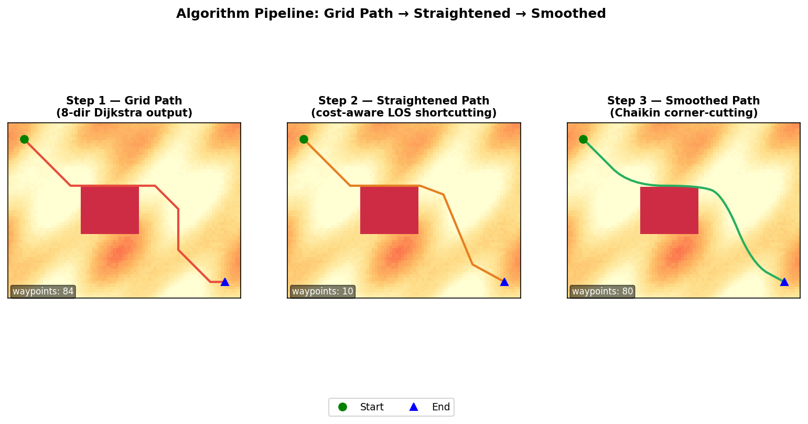
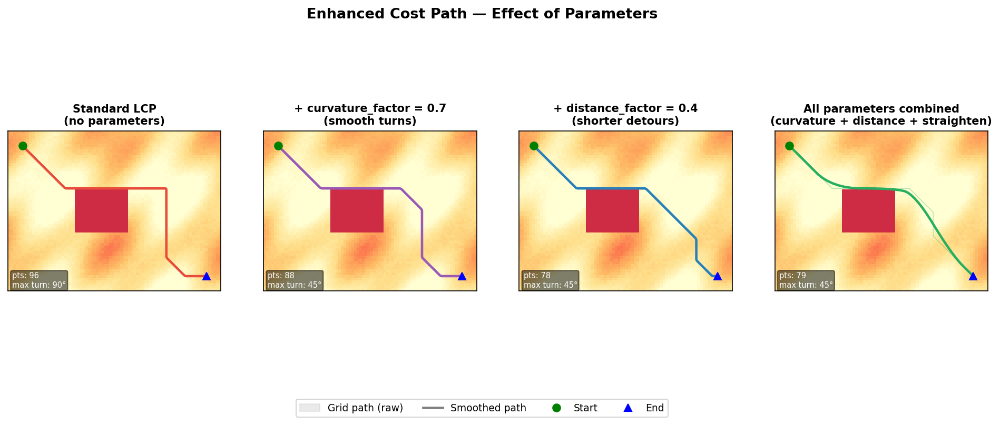
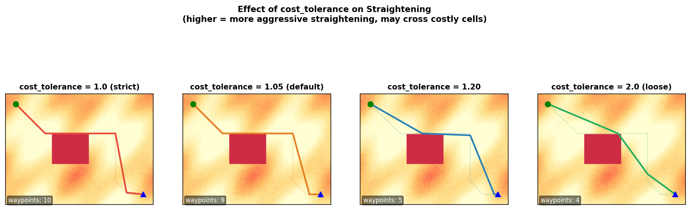

# Enhanced Cost Path with Parameters

> **中文文档** → [README_CN.md](README_CN.md)

A GIS tool that extends the standard Least Cost Path (LCP) algorithm with
**curvature control**, a **distance factor**, **cost-aware path
straightening**, and **Chaikin smoothing** — addressing fundamental
limitations of ESRI's built-in LCP tool.

Runs as a **standalone Python library** (no ArcGIS licence required) and
also ships as an **ArcGIS Pro Python Toolbox** (`.pyt`) for users who prefer
the geoprocessing UI.

---

## Table of Contents

1. [Why This Tool?](#1-why-this-tool)
2. [Geometric Principles](#2-geometric-principles)
3. [Visual Results](#3-visual-results)
4. [Parameters](#4-parameters)
5. [Quick Start](#5-quick-start)
6. [Download](#6-download)
7. [Repository Layout](#7-repository-layout)
8. [Running Tests](#8-running-tests)
9. [Licence](#9-licence)

---

## 1. Why This Tool?

ArcGIS's built-in *Least Cost Path* tool exposes only three inputs — a cost
raster, a source point, and a destination point.  In practice, several
additional controls are almost always needed:

| Limitation of native LCP | Consequence |
|---|---|
| **No curvature control** | Produces paths with abrupt, sharp turns that are unrealistic for roads, pipelines, or similar linear infrastructure. |
| **No distance weighting** | May route through a long, winding detour of low-cost cells when a slightly more expensive but far shorter path would be preferable. |
| **Grid-aligned zigzag artifacts** | 8-direction raster paths produce staircase-like segments that look unnatural, even when the overall routing is correct. |
| **No smooth curves** | Even with turn constraints, grid-aligned paths have angular corners; infrastructure design requires smooth arcs. |

This tool adds four complementary mechanisms — a **curvature penalty**, a
**distance penalty**, **cost-aware post-processing straightening**, and
**Chaikin smoothing** — while keeping full compatibility with any cost
raster.

---

## 2. Geometric Principles

### 2.1 8-Direction Grid Search

The algorithm performs a **modified Dijkstra search on an 8-connected
raster grid**.  From each cell, movement is allowed to all eight
neighbouring cells (cardinal and diagonal directions).

```
NW  N  NE        (row-1,col-1) (row-1,col) (row-1,col+1)
 W  ·  E    →    (row,  col-1)     ·       (row,  col+1)
SW  S  SE        (row+1,col-1) (row+1,col) (row+1,col+1)
```

The Euclidean step distance is:

- **Cardinal step** (N, S, E, W): `d = cell_size`
- **Diagonal step** (NE, NW, SE, SW): `d = √2 × cell_size`

This ensures that the path length metric is geometrically accurate.

When curvature control is active, the search **state** is extended from
`(row, col)` to `(row, col, incoming_direction)`.  This makes it possible
to compute the turning angle at every step and add it as a cost component,
at the expense of a larger state space (×8 more states).

### 2.2 Extended Cost Function

For each step from cell *A* → cell *B*, arriving from direction *d_in* and
leaving in direction *d_out*, the per-step cost is:

```
step_cost = base_cost
          + curvature_penalty
          + straightness_penalty
          + distance_penalty
```

| Component | Formula | When active |
|---|---|---|
| **base_cost** | `cost_raster[B] × step_distance` | Always |
| **curvature_penalty** | `curvature_factor × 5 × cost_scale × (θ / 180°) × step_distance` | `curvature_factor > 0` |
| **straightness_penalty** | `similarity × 0.3 × cost_scale × step_distance` | Direction changes in curvature-aware mode |
| **distance_penalty** | `distance_factor × cost_scale × step_distance` | `distance_factor > 0` |

**Key terms:**

- `θ` — turning angle in degrees between *d_in* and *d_out*  
  (0° = straight ahead, 45° = one diagonal, 90° = right-angle turn, 180° = U-turn).
- `cost_scale` — mean of all finite, non-negative raster values; keeps
  penalty terms in the same order of magnitude as the base cost.
- `similarity` — `max(0, 1 − |cost_B − cost_straight| / cost_scale)`.
  High when the target cell costs roughly the same as the straight-ahead
  cell; suppresses the anti-zigzag penalty in heterogeneous areas.

**Hard turn constraint:** when `max_turning_angle < 180°`, any transition
whose turning angle exceeds the threshold is completely pruned from the
search (not just penalised).

### 2.3 Cost-Aware Path Straightening

The raw Dijkstra path follows the raster grid and therefore contains
staircase-like zigzags.  A post-processing step reduces unnecessary
waypoints by trying to replace each multi-cell sub-segment with a direct
straight-line shortcut.

The algorithm uses the **supercover line** (grid-traversal rasterisation)
to enumerate every raster cell that a straight line passes through.
For each candidate shortcut *A → E*:

1. **Barrier check** — if any cell on the straight line is NODATA or outside
   the raster, the shortcut is rejected.
2. **Cost check** — the accumulated cost along the straight line
   (average cell cost × Euclidean distance) is compared to the original
   grid-path cost for the same segment:

```
Accept shortcut A → E  ⟺  cost(shortcut) ≤ cost(A→…→E) × cost_tolerance
```

This prevents the straightened path from cutting through high-cost regions
that the Dijkstra search correctly avoided.  The `cost_tolerance` parameter
(default 1.05 = 5% overhead allowed) gives explicit control over the
trade-off between visual straightness and cost fidelity.

### 2.4 Chaikin Smoothing

After straightening, **Chaikin's corner-cutting algorithm** replaces each
angular corner with a smooth arc through iterative subdivision.  Given
waypoints `[P₀, P₁, P₂, …]`, each iteration inserts two new points near
each interior vertex:

```
Q = 0.75 × Pᵢ + 0.25 × Pᵢ₊₁
R = 0.25 × Pᵢ + 0.75 × Pᵢ₊₁
```

After 3 iterations the result converges to a B-spline approximation of the
original polyline with rounded corners.  A final NODATA safety check falls
back to the un-smoothed path if any smoothed segment would cross a barrier.

---

## 3. Visual Results

### Algorithm Pipeline

The three post-Dijkstra processing stages transform the raw grid path into
a smooth, clean result:



| Stage | Typical waypoint count | Visual quality |
|---|---|---|
| Raw 8-dir grid path | ~100–200 per 100 cells | Staircase zigzags |
| Cost-aware straightened | 70–90% fewer | Clean straight segments |
| Chaikin smoothed | (density added) | Smooth arcs at corners |

---

### Effect of Parameters

Each parameter independently controls a different aspect of the path shape:



| Panel | Parameters | Observable effect |
|---|---|---|
| Standard LCP | All defaults (0) | Zigzag grid path; may take long detours |
| + curvature | `curvature_factor=0.7` | Gentler turns; path avoids sharp corners |
| + distance | `distance_factor=0.4` | Path pulled toward shorter routes |
| All combined | curvature + distance + straighten | Smooth, direct, realistic path |

---

### Cost Tolerance Effect

`cost_tolerance` controls how aggressively the straightening step takes
shortcuts around the grid path:



- **1.0** — only accept shortcuts as cheap or cheaper than the original.
- **1.05** *(default)* — allows 5% cost overhead; good balance.
- **1.2** — more aggressive straightening; may take slightly costly shortcuts.
- **2.0** — essentially NODATA-only check; maximum visual straightness.

---

## 4. Parameters

### Full parameter reference

| Parameter | Type | Range | Default | Description |
|---|---|---|---|---|
| `cost_raster` | 2-D NumPy array | — | *(required)* | Traversal cost surface. `NaN`/`Inf`/negative cells are impassable barriers. |
| `start` | `(row, col)` | — | *(required)* | Start cell (zero-based row/col index). |
| `end` | `(row, col)` | — | *(required)* | End cell (zero-based row/col index). |
| `curvature_factor` | float | 0.0 – 1.0 | 0.0 | Soft penalty for sharp turns. 0 = standard LCP; 1 = maximum smoothing. |
| `max_turning_angle` | float | 0 – 180 | 180.0 | Hard upper limit on turning angle (degrees). 180 = unrestricted. |
| `distance_factor` | float | 0.0 – 1.0 | 0.0 | Weight for path length. Higher ⇒ shorter paths preferred. |
| `straighten_factor` | float | 0.0 – 0.5 | 0.3 | Controls how far ahead the straightening step looks for shortcuts. |
| `cost_tolerance` | float | ≥ 1.0 | 1.05 | Maximum allowed ratio of shortcut cost to original path cost. |
| `cell_size` | `(y, x)` | — | `(1, 1)` | Physical cell dimensions in map units. |

### Output dictionary

| Key | Type | Description |
|---|---|---|
| `path` | `list[(int, int)]` | Raw 8-connected grid path from start to end. |
| `straightened_path` | `list[(float, float)]` | Path after cost-aware LOS straightening. |
| `smoothed_path` | `list[(float, float)]` | Final Chaikin-smoothed path with rounded corners. |
| `total_cost` | `float` | Accumulated cost along the optimal grid path. |
| `path_length` | `float` | Physical length of the grid path in map units. |
| `directions` | `list[int]` | Direction index (0–7) at each step. |
| `turning_angles` | `list[float]` | Turning angle in degrees at each interior vertex. |

---

## 5. Quick Start

### 5.1 Standalone Python

**Install dependencies:**

```bash
pip install numpy rasterio        # minimum
pip install numba                  # optional — 20–50× speedup on large rasters
```

**Basic usage:**

```python
import numpy as np
from pure_python.cost_aware_straighten_lcp import cost_aware_least_cost_path

# Example: 200×200 random cost raster
raster = np.random.default_rng(0).uniform(1, 10, (200, 200)).astype("float32")

result = cost_aware_least_cost_path(
    raster,
    start=(0, 0),
    end=(199, 199),
    curvature_factor=0.5,       # smooth turns
    max_turning_angle=135.0,    # no near-U-turns
    distance_factor=0.3,        # mildly prefer shorter paths
    straighten_factor=0.3,      # moderate post-processing straightening
    cost_tolerance=1.05,        # allow 5% cost overhead in shortcuts
)

print(f"Grid path cells    : {len(result['path'])}")
print(f"Straightened points: {len(result['straightened_path'])}")
print(f"Smoothed points    : {len(result['smoothed_path'])}")
print(f"Total cost         : {result['total_cost']:.2f}")
print(f"Path length        : {result['path_length']:.2f} map units")
print(f"Max turn angle     : {max(result['turning_angles']):.0f}°")
```

**Numba-accelerated version** (drop-in replacement, requires `numba`):

```python
from numba_accelerated.cost_aware_straighten_lcp import cost_aware_least_cost_path

result = cost_aware_least_cost_path(raster, (0, 0), (199, 199),
                                    curvature_factor=0.5)
```

**Loading a GeoTIFF cost raster:**

```python
import rasterio
import numpy as np
from pure_python.cost_aware_straighten_lcp import cost_aware_least_cost_path

with rasterio.open("cost_surface.tif") as src:
    data = src.read(1).astype("float64")
    data[data == src.nodata] = np.nan          # mark NODATA as barriers
    cell_y = abs(src.transform.e)              # pixel height in map units
    cell_x = abs(src.transform.a)              # pixel width  in map units

result = cost_aware_least_cost_path(
    data,
    start=(row_start, col_start),
    end=(row_end, col_end),
    cell_size=(cell_y, cell_x),
)
```

### 5.2 ArcGIS Pro

1. **Download** `EnhancedCostPath_ArcGIS.zip` from the
   [Releases page](../../releases/latest) and unzip it to a local folder.
2. In **ArcGIS Pro** → **Catalog** pane → **Toolboxes** → right-click →
   **Add Toolbox** → navigate to `arcgis_toolbox_with_progress.pyt`.
3. Expand the toolbox; you will see two tools:
   - **Cost-Aware LCP (Pure Python)** — works without additional dependencies.
   - **Cost-Aware LCP (Numba Accelerated)** — requires `numba` in the
     ArcGIS Pro Python environment
     (`conda install -c conda-forge numba`).
4. Double-click the desired tool, fill in the parameters, and click **Run**.
   Progress is reported step-by-step in the Geoprocessing pane.

---

## 6. Download

| Package | Contents | When to use |
|---|---|---|
| [EnhancedCostPath_ArcGIS.zip](../../releases/latest) | Toolbox + algorithm packages | ArcGIS Pro users |
| [EnhancedCostPath_Standalone.zip](../../releases/latest) | Algorithm packages only | Standalone Python / no ArcGIS |

To build packages yourself, run `bash release/build_release.sh` from the
repository root.  See [release/README.md](release/README.md) for details.

---

## 7. Repository Layout

```
Enhanced_CostPath_withParameters/
├── arcgis_toolbox_with_progress.pyt   ← ArcGIS Python Toolbox (latest)
├── pure_python/
│   └── cost_aware_straighten_lcp.py   ← Primary algorithm (pure Python)
├── numba_accelerated/
│   └── cost_aware_straighten_lcp.py   ← Numba JIT-accelerated algorithm
├── tests/                             ← Pytest test suite
├── docs/
│   ├── generate_readme_figures.py     ← Regenerate README images
│   ├── images/                        ← Figures used in this README
│   ├── COST_AWARE_LCP_EN.md           ← Detailed English algorithm docs
│   ├── COST_AWARE_LCP_CN.md           ← Detailed Chinese algorithm docs
│   ├── TOOL_REPORT_CN.md              ← Development report (Chinese)
│   └── PERFORMANCE_ANALYSIS_CN.md    ← Performance analysis (Chinese)
├── release/
│   ├── README.md                      ← Packaging instructions
│   └── build_release.sh               ← Script to build distributable zips
├── archive/                           ← Earlier algorithm variants (Approaches A & B)
├── requirements.txt
├── README.md                          ← This file (English)
└── README_CN.md                       ← Chinese translation
```

---

## 8. Running Tests

```bash
# Install test dependencies
pip install pytest numpy

# Run pure-Python tests (no numba required)
python -m pytest tests/test_cost_aware_straighten_lcp.py tests/test_progress_callback.py -v

# Run all tests (includes Numba-accelerated variant)
pip install numba
python -m pytest tests/ -v
```

---

## 9. Licence

MIT

```
Permission is hereby granted, free of charge, to any person obtaining a copy
of this software and associated documentation files (the "Software"), to deal
in the Software without restriction, including without limitation the rights
to use, copy, modify, merge, publish, distribute, sublicense, and/or sell
copies of the Software, and to permit persons to whom the Software is
furnished to do so, subject to the following conditions: The above copyright
notice and this permission notice shall be included in all copies or
substantial portions of the Software. THE SOFTWARE IS PROVIDED "AS IS",
WITHOUT WARRANTY OF ANY KIND.
```
